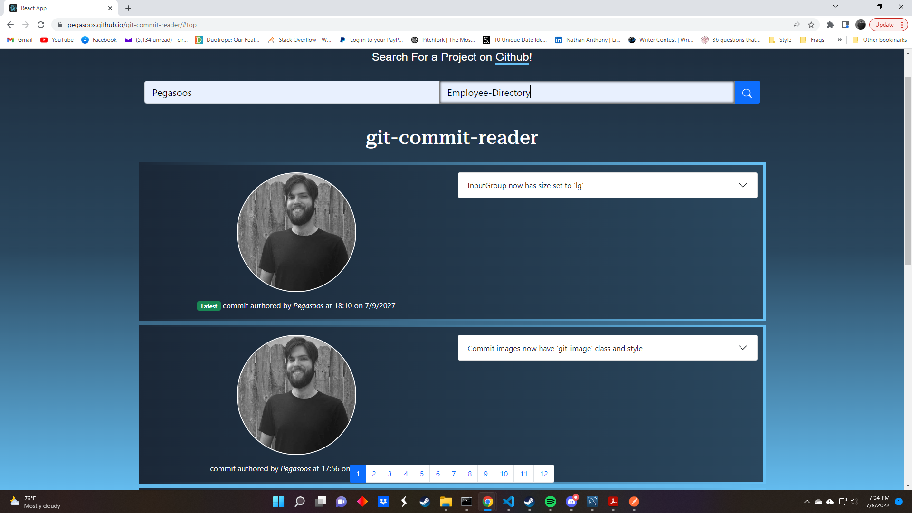

# Git Commit Search

## Table of Contents
 1. [Description](#description)
 2. [Installation](#installation)
 3. [Usage](#usage)
 4. [Contributing](#contributing)
 5. [Tests](#tests)
 6. [License](#license)
 7. [Questions](#questions)

## Description
### Git Commit Search is an applicaiton that allows users to view the commit history of a github repo of their choosing The commit history of the project itself displays initially as a demo. 
### The application can be used online here: https://pegasoos.github.io/git-commit-reader/#top
## Installation
### 1. Open the command line interpreter of your choice (powershell, terminal, etc.).
### 2. Use your command line interpreter to navigate to the folder you wish to keep the application in using the command "cd {the path to the folder goes here}".
### 3. Use a package manager, such as npm or yarn, to install the necessary packages using the install command (Example: "npm install" or "yarn install") into your command line interpreter and execute it by pressing the ENTER key.
### 4. Ensure no processes are running on the localhost at Port 3000 by visiting http://localhost:3000. Run the start script by entering the command "npm start" or "yarn start" into your command line interpreter and executing it.
### 5. The application should open in your browser after in finishes compiling.
## Usage
### Enter the name of the Github User into the first search form and the name of the repository into the second form, then press the search button to query the API and display results.
## Contributing
### 
## Tests
### 
## License
### Distributed under the IBM_Public_Licence_Version_1.0
## Questions
### Email: definitelyisntme@gmail.com
### Github: [https://github.com/Pegasoos](https://github.com/Pegasoos)